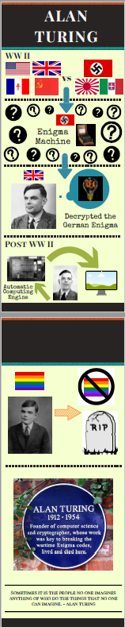
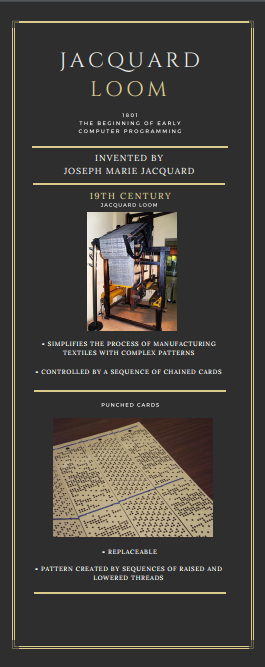
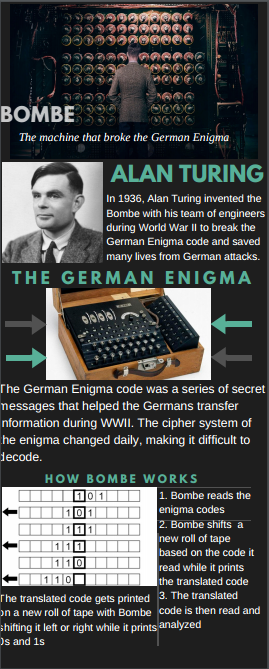

# Computer History Infographic
Pick a topic you found interesting on the history of computer science. Search the web to find ideas on what images, diagrams and other visuals would help to explain your topic. 
 
Register for free at [Canva.com](http://www.canva.com). Click [here](https://www.youtube.com/watch?v=W1v3ILOnfGs) to watch a video for some ideas on how to make your infographic. Canva.com also has a number of templates you can start with to create an infographic on your topic. Your infographic may have up to 3 pages.
 
Download your finished infographic by downloading it from canva.com and choosing *PDF - standard*. 

Samples of Student Work
----------------------
[Alyssa](AlyssaAdaLovelace.PNG)  
Crystal   
   
Cynthia   
   
Emma   
   
JingHumanComputers.PNG	Add files via upload	24 seconds ago
README.md	Update README.md	2 minutes ago
RainehGraceHopper.PNG	Add files via upload	24 seconds ago
TheoBabbagesDifferenceMachine.PNG	Add files via upload	24 seconds ago
XiaoQinBoole.PNG
